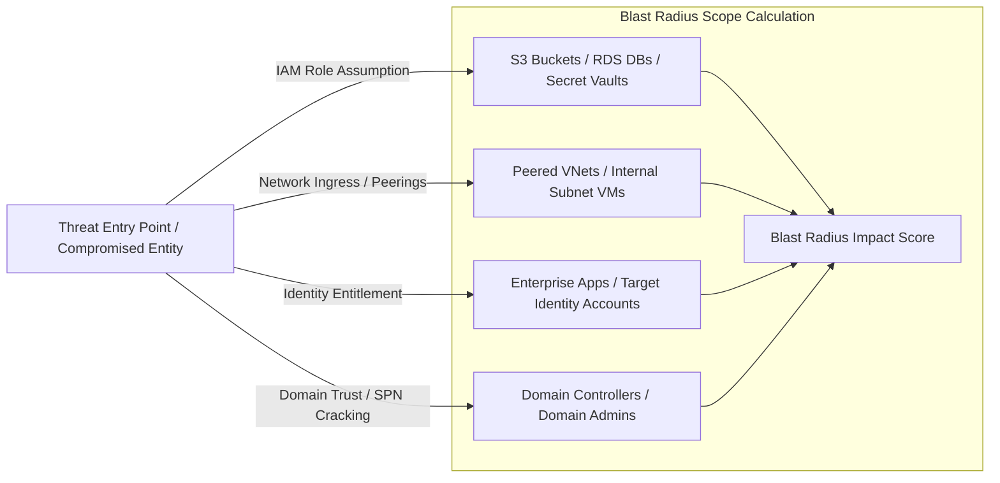

# Threat Assessment Blast Radius Engine: Data Specification, Extraction & Graph Analytics Architecture

This document specifies the data requirements, extraction commands, API endpoints, relational schemas, and graph-relational join logic required to calculate the **Blast Radius** of a security threat across **13 Enterprise Source Systems**.

---

## 📁 Artifact & CSV Dataset Links
1. **Detailed Dataset Specification CSV**: [`threat_blast_radius_data_spec.csv`](file:///C:/Users/admin/.gemini/antigravity/scratch/threat_blast_radius_data_spec.csv)
2. **Blast Radius Summary & Impact Matrix CSV**: [`blast_radius_summary_matrix.csv`](file:///C:/Users/admin/.gemini/antigravity/scratch/blast_radius_summary_matrix.csv)

---

## 💥 What is "Blast Radius" in Threat Assessment?

> [!IMPORTANT]
> **Definition**: The **Blast Radius** represents the total set of downstream entities, systems, data stores, user accounts, and network segments that can be accessed, compromised, exfiltrated, or destroyed if a specific primary entity (e.g. an EC2 instance, IAM role, AD user, or Service Principal) is breached.



---

## 🏷️ Status Tracking & Schema Field Delta Analysis

Every data feed across the 13 sources is assigned a **Status Tag**:
- **`EXISTING`**: Data that was fully captured in the baseline `threat_assessment_data_spec.csv` (e.g., CloudTrail trail configs, Vault audit devices, Entra ID risk detections).
- **`CHANGED`**: Data that was in the baseline specification, but **expanded with critical new fields** specifically required to perform Blast Radius calculation (e.g., adding `TrustRelationships`, `VpcPeeringConnections`, `GroupMemberships`, `ManagerHierarchy`, `AdminCount`, `SPNs`).
- **`NEW`**: Completely new data feeds and API endpoints introduced specifically to map topology, connected storage, lateral movement, and asset criticality (e.g., EC2 Instance Topology, Azure Key Vault Secrets, GCP BigQuery Datasets, AD Domain Trusts, Defender Lateral Movement Paths, EDR Active Sockets).

---

## 🔍 Detailed System Analysis & Blast Radius Download Mechanics

### 1. Amazon Web Services (AWS)

* **EC2 Instances & Network Interfaces (`NEW`)**:
  * *Command*: `aws ec2 describe-instances --output json && aws ec2 describe-network-interfaces --output json`
  * *What to Extract*: Instance ID, Private IP, Public IP, SubnetId, VpcId, SecurityGroups, IAMInstanceProfile, Tags (Environment, DataSensitivity).
  * *Blast Radius Impact*: Maps initial breach entry points to connected subnets and instance IAM profiles.
* **IAM Policy & AssumeRole Graph (`CHANGED`)**:
  * *Command*: `aws iam get-account-authorization-details --output json`
  * *Added Fields*: `TrustRelationships` (`AssumeRolePolicyDocument`), `CrossAccountRoleArns`, `TransitiveRolePermissions`.
  * *Blast Radius Impact*: Traverses role assumption chains across AWS accounts to measure cloud identity blast radius.
* **VPC Security Groups & Peering Topology (`CHANGED`)**:
  * *Command*: `aws ec2 describe-security-groups --output json && aws ec2 describe-vpc-peering-connections --output json`
  * *Added Fields*: `VpcPeeringConnectionId`, `RequesterVpcInfo`, `AccepterVpcInfo`, `ConnectedSubnets`.
  * *Blast Radius Impact*: Computes cross-VPC network reachability when a subnet security group is breached.
* **S3 Buckets & Resource Policies (`NEW`)**:
  * *Command*: `aws s3api list-buckets --output json && aws s3api get-bucket-policy --bucket <b_name>`
  * *What to Extract*: BucketName, BucketPolicy, PublicAccessBlock, KMSMasterKeyId, Tags, DataClassification.
  * *Blast Radius Impact*: Quantifies sensitive data exfiltration exposure accessible by compromised IAM role.

---

### 2. Microsoft Azure

* **Virtual Machines & Network Interfaces (`NEW`)**:
  * *Command*: `az vm list --show-details --output json && az network nic list --output json`
  * *What to Extract*: VM ID, Private IP, Public IP, SubnetId, NetworkSecurityGroup, ManagedIdentityPrincipalId, Tags.
  * *Blast Radius Impact*: Identifies public-facing VMs bound to Managed Identities with Subscription Owner/Contributor rights.
* **Subscription RBAC & Transitive Groups (`CHANGED`)**:
  * *Command*: `az role assignment list --all --output json && az ad group member list --group <g_id>`
  * *Added Fields*: `TransitiveGroupMemberships`, `ResourceGroup`, `ScopeInheritance`.
  * *Blast Radius Impact*: Resolves nested Entra ID group memberships inheriting subscription permissions.
* **NSG Rules & VNet Peering Topology (`CHANGED`)**:
  * *Command*: `az graph query -q "Resources | where type =~ 'Microsoft.Network/networkSecurityGroups'" && az network vnet peering list`
  * *Added Fields*: `RemoteVirtualNetworkId`, `AllowForwardedTraffic`, `ConnectedVMIds`.
  * *Blast Radius Impact*: Maps cross-subscription lateral movement radius enabled by permissive VNet peerings.
* **Key Vault Access Policies & Secrets (`NEW`)**:
  * *Command*: `az keyvault list --output json && az keyvault secret list --vault-name <v_name>`
  * *What to Extract*: VaultUri, AccessPolicies, ManagedIdentityBindings, SecretNames, KeyTypes.
  * *Blast Radius Impact*: Counts database connection strings, API keys, and certificates accessible from breached Managed Identity.

---

### 3. Google Cloud Platform (GCP)

* **Compute Instances & Network Attachments (`NEW`)**:
  * *Command*: `gcloud compute instances list --format=json`
  * *What to Extract*: Instance ID, Internal IP, External IP, NetworkInterfaces, ServiceAccountScopes, Tags, VPC Network.
  * *Blast Radius Impact*: Measures project-level blast radius if instance metadata service account token is stolen.
* **Project IAM & Service Account Keys (`CHANGED`)**:
  * *Command*: `gcloud projects get-iam-policy <p_id> --format=json && gcloud iam service-accounts list`
  * *Added Fields*: `ServiceAccountKeys`, `ImpersonationPermissions` (`roles/iam.serviceAccountTokenCreator`), `InheritedFolderPolicies`.
  * *Blast Radius Impact*: Computes cross-project reachability via service account token creation and key export.
* **VPC Firewalls & Network Peerings (`CHANGED`)**:
  * *Command*: `gcloud compute firewall-rules list --format=json && gcloud compute networks peerings list`
  * *Added Fields*: `PeerNetwork`, `AutoCreateRoutes`, `TargetServiceAccounts`.
  * *Blast Radius Impact*: Maps network propagation bounds across GCP Shared VPCs and Peered VPC networks.
* **Cloud Storage & BigQuery Datasets (`NEW`)**:
  * *Command*: `gcloud storage buckets list --format=json && bq ls --format=json`
  * *What to Extract*: BucketName, IAMPolicy, DatasetID, AccessEntries (Grants), DataClassification.
  * *Blast Radius Impact*: Sums sensitive PII/PCI analytics tables and storage objects readable by compromised IAM principal.

---

### 4. HashiCorp Vault

* **Secret Mounts & Token Accessors (`NEW`)**:
  * *Command*: `vault secrets list -format=json && vault list auth/token/accessors -format=json`
  * *What to Extract*: Path, Engine Type (KV, AWS, PKI, DB), BoundCIDRs, Token Accessors, TTL, MaxTTL.
  * *Blast Radius Impact*: Identifies external cloud infrastructure engines controlled via compromised Vault token.
* **ACL Policy Path Traversal (`CHANGED`)**:
  * *Command*: `vault policy list -format=json && vault policy read <policy_name> -format=json`
  * *Added Fields*: `AllowedParameters`, `DeniedParameters`, `CrossMountPermissions`.
  * *Blast Radius Impact*: Traverses path rules to map all secret engine KV paths and system settings accessible by policy.
* **Vault Identity Entities & Groups (`NEW`)**:
  * *Command*: `vault list identity/entity/id -format=json && vault list identity/group/id -format=json`
  * *What to Extract*: Entity ID, Entity Name, Associated Policies, Group Memberships, Aliases (OIDC/LDAP).
  * *Blast Radius Impact*: Calculates total human and machine identities affected if a Vault Identity Group is breached.

---

### 5. BeyondTrust Privileged Access Management (PAM)

* **PAM Managed Assets & Account Inventory (`NEW`)**:
  * *API*: `GET https://beyondtrust.company.lan/api/v1/assets && GET /api/v1/managed-accounts`
  * *What to Extract*: SystemID, HostName, IPAddress, OS, ManagedAccounts, AssetCriticality.
  * *Blast Radius Impact*: Total count of servers and domain assets reachable using credentials stored in BeyondTrust vault.
* **PAM Checked-Out Sessions & Target IPs (`CHANGED`)**:
  * *API*: `GET https://beyondtrust.company.lan/api/v1/active-sessions`
  * *Added Fields*: `TargetIP`, `CheckedOutPasswordID`, `AssociatedITSMTicket`, `DownstreamAccessibleHosts`.
  * *Blast Radius Impact*: Calculates lateral movement blast radius by joining checked-out credentials with target systems.
* **PAM Smart Rule User Policies (`NEW`)**:
  * *API*: `GET https://beyondtrust.company.lan/api/v1/user-policy-assignments`
  * *What to Extract*: UserID, GroupID, ManagedAssetGroups, PasswordReleasePolicies, MaxCheckoutDuration.
  * *Blast Radius Impact*: Count of systems where compromised PAM user can auto-request privileged administrator credentials.

---

### 6. SailPoint Identity Governance

* **Identity Hierarchy & Direct Reports (`CHANGED`)**:
  * *API*: `GET https://tenant.api.identitynow.com/v3/public-identities`
  * *Added Fields*: `ManagerID`, `ManagerEmail`, `DirectReports`, `CompositeRiskScore`.
  * *Blast Radius Impact*: Identifies all direct reports and subordinate access profiles impacted if manager account is breached.
* **Application Accounts & Target System Maps (`NEW`)**:
  * *API*: `GET https://tenant.api.identitynow.com/v3/accounts && GET /v3/sources`
  * *What to Extract*: AccountID, NativeIdentity, SourceName (AWS, AD, SAP, Salesforce), UncorrelatedFlag, DisabledFlag.
  * *Blast Radius Impact*: Maps single SailPoint identity token to all target application accounts (AWS, AD, SAP).
* **Access Profiles & Entitlement Bundles (`NEW`)**:
  * *API*: `GET https://tenant.api.identitynow.com/v3/access-profiles && GET /v3/roles`
  * *What to Extract*: ProfileID, ProfileName, EntitlementsList, SourceID, OwnerID, EnabledState.
  * *Blast Radius Impact*: Total downstream enterprise entitlements granted across all identities assigned a breached Access Profile.

---

### 7. Active Directory & GPO

* **AD Computer Objects & Domain Trusts (`NEW`)**:
  * *Command*: `Get-ADComputer -Filter * -Properties IPv4Address, OperatingSystem, ServicePrincipalNames && Get-ADDomainTrust`
  * *What to Extract*: ComputerName, OS, IPAddress, SPNs, TrustType, TrustDirection, TargetDomainName.
  * *Blast Radius Impact*: Count of domain computers and connected domain forests accessible via compromised domain trust.
* **User Attributes & Service Principal Names (`CHANGED`)**:
  * *Command*: `Get-ADUser -Filter * -Properties MemberOf, PasswordLastSet, AdminCount, SidHistory, ServicePrincipalName`
  * *Added Fields*: `AdminCount`, `SidHistory`, `ServicePrincipalName` (SPNs).
  * *Blast Radius Impact*: Calculates administrative blast radius via `AdminCount = 1`, SidHistory cross-domain rights, and SPNs.
* **Service Accounts & Kerberoastable SPNs (`NEW`)**:
  * *Command*: `Get-ADUser -Filter {ServicePrincipalName -ne "$null"} -Properties ServicePrincipalName, PasswordLastSet, msDS-SupportedEncryptionTypes`
  * *What to Extract*: SamAccountName, SPN, PasswordLastSet, PasswordPolicy, EncryptionTypes (RC4 vs AES).
  * *Blast Radius Impact*: Count of SQL/IIS services and servers susceptible to offline Kerberoasting ticket cracking.

---

### 8. Microsoft Entra ID

* **Service Principals & App Registrations (`NEW`)**:
  * *API*: `GET https://graph.microsoft.com/v1.0/servicePrincipals && GET /v1.0/applications`
  * *What to Extract*: AppId, DisplayName, KeyCredentials, PasswordCredentials (Expiration), OAuth2PermissionGrants.
  * *Blast Radius Impact*: Total Entra ID tenant APIs and cloud resources accessible via compromised Service Principal secret.
* **Directory Roles & PIM Assignments (`CHANGED`)**:
  * *API*: `GET https://graph.microsoft.com/v1.0/roleManagement/directory/roleAssignments?$expand=principal,roleDefinition`
  * *Added Fields*: `TransitiveRoleAssignments`, `EligibleRoleAssignments` (PIM), `ScopedRoleAssignments` (Administrative Units).
  * *Blast Radius Impact*: Total user accounts, groups, and applications manageable by principal via direct or PIM eligible admin roles.
* **Entra ID Security & Dynamic Groups (`NEW`)**:
  * *API*: `GET https://graph.microsoft.com/v1.0/groups?$expand=members`
  * *What to Extract*: GroupId, DisplayName, GroupTypes, SecurityEnabled, MemberIDs, OwnerIDs, DynamicMembershipRules.
  * *Blast Radius Impact*: Number of identities inheriting access or policy exclusions if group membership is manipulated.

---

### 9. Entra ID Protection

* **Risky Users & Risky Service Principals (`NEW`)**:
  * *API*: `GET https://graph.microsoft.com/v1.0/identityProtection/riskyUsers && GET /v1.0/identityProtection/riskyServicePrincipals`
  * *What to Extract*: UserPrincipalName, RiskLevel, RiskDetail, TransitiveRiskScore, ImpactedAppsCount.
  * *Blast Radius Impact*: Count of enterprise M365 apps and Azure subscriptions directly accessible via high-risk entity.

---

### 10. Microsoft Defender for Identity

* **Lateral Movement Paths (LMP) (`NEW`)**:
  * *API*: `GET https://graph.microsoft.com/v1.0/security/identities/lateralMovementPaths`
  * *What to Extract*: SourceIdentity, TargetIdentity, HopCount, IntermediateDevices, SensitiveAccountFlag.
  * *Blast Radius Impact*: Calculates exact chain of compromised computers and local admin credentials required to reach Domain Controller.
* **Domain Security Alerts & Compromised Entities (`CHANGED`)**:
  * *API*: `GET https://graph.microsoft.com/v1.0/security/alerts?$filter=vendorInformation/provider eq 'Defender for Identity'`
  * *Added Fields*: `CompromisedHostIP`, `TargetServiceAccount`, `CompromisedKerberosTicket`.
  * *Blast Radius Impact*: Connects alert evidence (compromised host/user) to active Lateral Movement Paths.

---

### 11. Wiz.io CSPM

* **Wiz Cloud Security Graph Search (`NEW`)**:
  * *API*: `POST https://api.wiz.io/graphql` (Query: `graphSearch`)
  * *What to Extract*: SourceResourceID, TargetResourceID, RelationshipType (`CONNECTS_TO`, `CAN_ASSUME`, `EXPOSES_SECRET_TO`), VulnerabilitySeverity.
  * *Blast Radius Impact*: Graph traversal score: Total count of cloud nodes and data stores downstream from entry asset.
* **Toxic Combinations & Exposed Secret Stores (`CHANGED`)**:
  * *API*: `POST https://api.wiz.io/graphql` (Query: `issues`)
  * *Added Fields*: `ExposedSecretTypes`, `PublicNetworkRouteId`, `DownstreamDBs`.
  * *Blast Radius Impact*: Sum of exposed API keys, SSH keys, and accessible downstream database entities.

---

### 12. Control Libraries (CIS Benchmarks)

* **Asset Compliance Coverage & Criticality (`CHANGED`)**:
  * *Method*: CIS-CAT Pro CLI / OpenSCAP report evaluation
  * *Added Fields*: `AssetCriticalityLevel` (High/Critical), `DataClassification` (PII/PCI), `ImpactScope`.
  * *Blast Radius Impact*: Computes blast radius score weighted by asset criticality (Production vs Dev).

---

### 13. EDR / OS Telemetry

* **Active Sockets & Network Connections (`NEW`)**:
  * *Method*: Windows Event Log ID 5156 / Sysmon Event ID 3 / EDR Telemetry API
  * *What to Extract*: SourceIP, SourcePort, DestinationIP, DestinationPort, Protocol, ProcessName, ProcessId, User.
  * *Blast Radius Impact*: Construct active network connection graph to identify live lateral movement propagation targets.
* **Process Execution & Parent-Child Trees (`CHANGED`)**:
  * *Method*: Windows Event Log ID 4688 / Sysmon Event ID 1
  * *Added Fields*: `ProcessTreeId`, `ProcessGuid`, `ParentProcessGuid`, `ChildProcessGuid`, `NetworkInitiatedFlag`.
  * *Blast Radius Impact*: Build process lineage tree (parent -> child -> grandchild) to calculate endpoint execution blast radius.

---

## 🧮 5. Blast Radius Graph-Relational Data Model & DDL Updates

To support fast graph traversal queries across relational DB systems (PostgreSQL / MySQL), the following **Edge Topology Table** is added to link all 13 systems:

```sql
-- Global Entity Graph Edge Table for Blast Radius Traversal
CREATE TABLE security_blast_radius_edges (
    edge_id SERIAL PRIMARY KEY,
    source_system VARCHAR(32) NOT NULL, -- e.g., 'AWS', 'AZURE', 'AD', 'SAILPOINT'
    source_entity_id VARCHAR(256) NOT NULL,
    source_entity_type VARCHAR(64) NOT NULL, -- e.g., 'EC2_INSTANCE', 'IAM_ROLE', 'AD_USER', 'PAM_SESSION'
    target_system VARCHAR(32) NOT NULL,
    target_entity_id VARCHAR(256) NOT NULL,
    target_entity_type VARCHAR(64) NOT NULL, -- e.g., 'S3_BUCKET', 'KEY_VAULT', 'DOMAIN_ADMIN', 'RDS_DB'
    relationship_type VARCHAR(64) NOT NULL, -- e.g., 'CAN_ASSUME', 'PEERED_TO', 'HAS_CREDENTIAL_FOR', 'MEMBER_OF'
    is_cross_boundary BOOLEAN DEFAULT FALSE, -- Cross-account / cross-subscription / cross-domain flag
    sensitivity_weight INT DEFAULT 1 CHECK (sensitivity_weight BETWEEN 1 AND 10),
    created_at TIMESTAMP WITH TIME ZONE DEFAULT CURRENT_TIMESTAMP
);

CREATE INDEX idx_blast_radius_traversal ON security_blast_radius_edges (source_entity_id, relationship_type);
```

### Recursive Blast Radius Calculation Query (SQL Example)
```sql
WITH RECURSIVE blast_radius_chain AS (
    -- Anchor member: Initial compromised entry point
    SELECT 
        source_entity_id, target_entity_id, relationship_type, sensitivity_weight, 1 AS hop_depth
    FROM security_blast_radius_edges
    WHERE source_entity_id = 'arn:aws:iam::123456789012:role/WebCompromisedRole'
    
    UNION ALL
    
    -- Recursive member: Downstream connected entities
    SELECT 
        e.source_entity_id, e.target_entity_id, e.relationship_type, e.sensitivity_weight, c.hop_depth + 1
    FROM security_blast_radius_edges e
    INNER JOIN blast_radius_chain c ON e.source_entity_id = c.target_entity_id
    WHERE c.hop_depth < 5 -- Max 5 hops depth
)
SELECT 
    target_entity_id, 
    MIN(hop_depth) AS shortest_hop, 
    SUM(sensitivity_weight) AS cumulative_impact_score
FROM blast_radius_chain
GROUP BY target_entity_id
ORDER BY cumulative_impact_score DESC;
```
