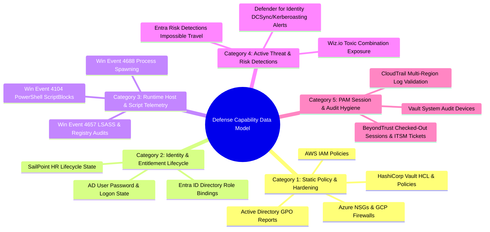
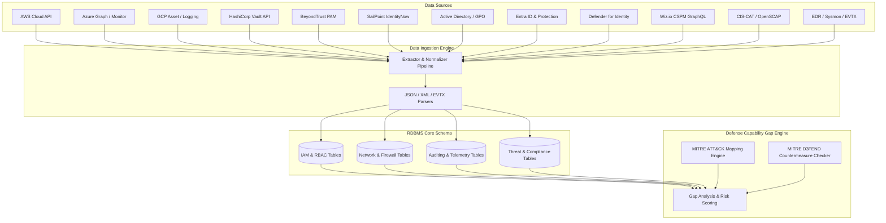

# Threat Assessment & Defense Capability Check Application: Comprehensive Technical Specification & System Data Model

This document serves as the master architecture blueprint, extraction guide, database schema specification, and **data extraction rationale** for building the **Threat Assessment and Defense Capability Check Application**. The application correlates threat intelligence (Threat Bulletins) against **MITRE ATT&CK** techniques and **MITRE D3FEND** countermeasures, comparing required defensive posture against live telemetry ingested from enterprise source systems.

---

## 📁 Artifact & Dataset Link
- **Generated CSV Specification File**: [`threat_assessment_data_spec.csv`](file:///C:/Users/admin/.gemini/antigravity/scratch/threat_assessment_data_spec.csv)

---

## 💡 1. Why Data Beyond Policy Setup Was Extracted (Data Extraction Rationale)

Evaluating **Policy Setup alone creates dangerous blind spots** and leads to false positive security assessments. A security policy might look perfectly hardened on paper, but an active attacker can bypass static policies using compromised credentials, living-off-the-land binaries (LOLBins), or operational drift.

To provide a true **Defense Capability Gap Check**, data was categorized into **5 Distinct Planes**:

---

### Data Category Breakdown & Extraction Reasons

| Data Category | Systems Ingested | What Is Extracted | Technical Reason For Extraction | Defense Gap Identified |
| :--- | :--- | :--- | :--- | :--- |
| **1. Static Policy & Hardening** | AWS IAM, Azure NSG, GCP Firewall, Vault HCL, AD GPO | Firewall rules, IAM Json docs, GPO XML settings, listener configs | Establishes the **Preventive Baseline** (`D3-NI`, `D3-POA`, `D3-SPH`). Evaluates what access is explicitly permitted. | Detects excessive wildcard permissions (`Resource: *`), open admin ports (`0.0.0.0/0:22`), or missing LSA memory protection. |
| **2. Identity & Entitlement Lifecycle** | SailPoint IdentityNow, AD Users, Entra ID Roles | User lifecycle state (Active/Terminated), group memberships, password flags | Validates **Identity Hygiene** (`D3-IAM`, `D3-UAR`). Policies cannot show if an admin account belongs to a terminated employee. | Detects terminated staff holding `Domain-Admin` or `AWS-Admin`, accounts with `PasswordNeverExpires`, or stale admin accounts. |
| **3. Runtime Telemetry & Host Activity** | EDR Win Events (4688, 4104, 4657), Sysmon | Process command lines, parent-child relationships, obfuscated scripts, LSASS access | Evaluates **Execution & Obfuscation Detection** (`D3-PSA`, `D3-SBA`, `D3-MMP`). Attacks occur inside valid policy boundaries. | Detects Word/Excel spawning `cmd.exe` or `powershell.exe`, encoded scripts (`-enc`), and LSASS memory dumping attempts. |
| **4. Real-Time Threat Detections** | Defender for Identity, Entra Risk Detections, Wiz.io | DCSync, Kerberoasting alerts, impossible travel risks, toxic combinations | Measures **Detection Readiness & Incident Response State** (`D3-ANOM`, `D3-ITA`). Verifies if active attacks are caught and closed. | Identifies active, un-remediated domain attacks, leaked credentials, or public VMs exposing SSH keys + database secrets. |
| **5. PAM Session & Audit Hygiene** | BeyondTrust PAM, CloudTrail, Vault Audit | Checked-out PAM sessions, ITSM ticket references, trail validation flags | Validates **Operational Accountability & Logging Integrity** (`D3-PAM`, `D3-AL`). Ensures admins cannot bypass change control. | Detects SSH/RDP sessions operating without an approved ITSM ticket, checkouts exceeding time limits, or disabled audit logs. |

---

## ⚔️ 2. Defense Gap Matrix: Policy Setup vs. Multi-Plane Telemetry

> [!IMPORTANT]
> The table below illustrates why assessing **Threat Bulletins against Defense Capabilities** requires looking beyond static policy setups.

| Threat Scenario (MITRE ATT&CK) | Static Policy Setup View | Reality Check via Other Extracted Data | Defense Gap Exposed |
| :--- | :--- | :--- | :--- |
| **T1078 - Valid Accounts (Compromised Credential Access)** | AWS IAM Policy permits `s3:GetObject` for `User-John`. Policy appears normal. | **SailPoint Data**: `User-John` was marked **TERMINATED in HR 14 days ago**. | **Privilege Lifecycle Gap**: Deprovisioning failed; terminated employee retains cloud access. |
| **T1059.001 - PowerShell Script Execution** | GPO policy allows execution of signed PowerShell scripts on workstations. | **EDR Event 4104 Data**: Base64 encoded payload executed: `powershell -enc aW52b2tl...` | **Obfuscation Detection Gap**: Lack of real-time script block analysis to catch obfuscated bypasses. |
| **T1021.001 - Remote Services (RDP/SSH Pivot)** | Security Group allows RDP from PAM Bastion IP `10.0.1.50`. Configuration is valid. | **BeyondTrust PAM API**: Active RDP session from `10.0.1.50` with **No ITSM Ticket Number** and **Checkout Exceeded (+3 hours)**. | **PAM Hygiene & Change Control Gap**: Unauthorized rogue administrative session running without change control. |
| **T1558 - Kerberoasting / DCSync Attack** | AD Domain Controller GPOs have standard Kerberos policy enabled. | **Defender for Identity API**: Open **High Severity Alert**: `DCSync attack detected from Host-X`, status = `UNRESOLVED`. | **Detection & Response Gap**: Attack succeeded and alert was triggered, but SOC response failed to isolate host. |
| **T1562.001 - Impair Defenses (Log Disabling)** | AWS CloudTrail enabled in `us-east-1`. | **CloudTrail Config API**: `IsMultiRegionTrail = FALSE` and `LogFileValidationEnabled = FALSE`. | **Audit Tampering Gap**: Logs can be altered or deleted by attackers pivoting to secondary regions. |

---

## 🏗️ 3. Global RDBMS Architecture & Data Pipeline Strategy

---

## 🔍 4. Detailed Tool-by-Tool Download Mechanics & RDBMS Schema

*(Refer to complete PostgreSQL DDL and tool extraction specs in previous sections)*
